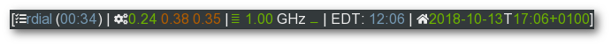

Getting started
===============

Basic usage
-----------

The command interface is — I hope — quite intuitive.  The following is a sample
session:

.. code-block:: console

    $ rdial start my_task
    $ rdial running
    Task my_task has been running for 0:12:38
    $ rdial stop -m'Fixed bug #40'
    Task my_task running for 0:44:00

Help on individual subcommands is available via ``rdial <subcommand> --help`` or
in the :doc:`usage <usage>` document.

Current task
------------

The current task name is written to the database directory in the
:file:`.current` file.  You could, for example,  use its contents to populate
notifiers in task bars.

As the file is created when the user executes :command:`rdial start` you can
also use its modification time to quickly calculate a running time for the task.

See the :doc:`taskbar integration <taskbars>` document for some guidance on
using  :program:`rdial` in various environments.
